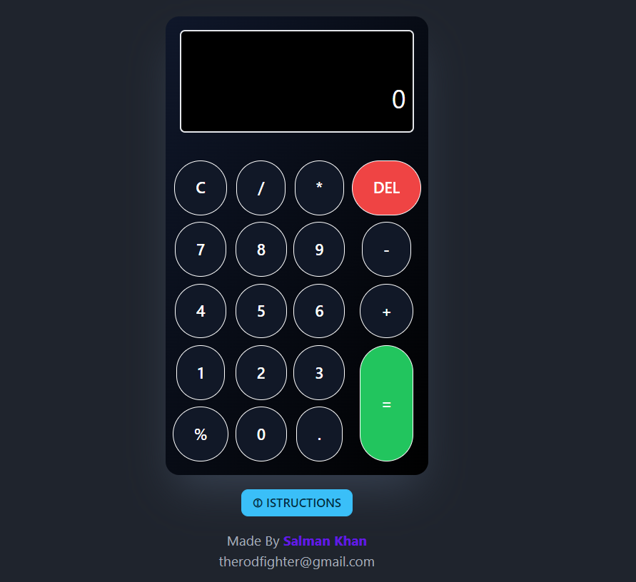

<h1>React calculator</h1>

 
<h1>Test it yourself => <a href="https://salman3001.github.io/calculator-react/" target="_blank">here</a></h1>
<ul>
    <li> this a simple react calculator.</li>
    <li>its performs all the common tasks like add, subtract, multiply, divide and percentage.</li>
    <li>You can use it with mouse and keyboard. </li>
</ul>
